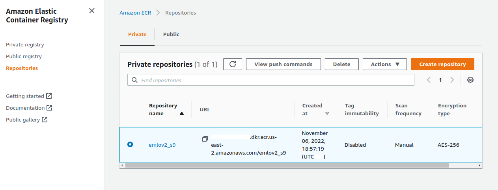
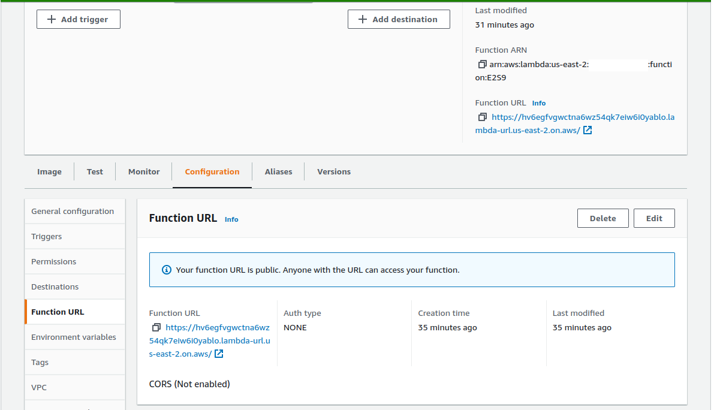
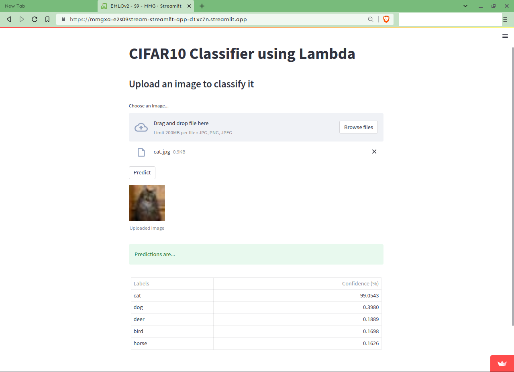

# EMLO Session 9

The goal of the assignment is to deploy our model to a serverless GPU and host it with a frontend.

## Part 1 - Serverless

A Dockerfile was created that inherits from the image `public.ecr.aws/lambda/python:3.8`. The actual code simply loads the model and makes a prediction.


The resulting image can be tested locally via

```
python test_local.py
```

We can then upload the image to ECR and create a lambda function that invokes this image.



Traditionally, we had to create an API using API gateway. However, I just noticed that Lambda can use an optional function URI that makes API Gateway unnecessary for our use case.



This URL can be used to test our image.

```
python test_lambda.py
```


## Part 2 - Front-end

We then create a streamlit app. It is similar to the `test_lambda.py` file. We can create an app and host it on Streamlit Cloud, and it will generate a (free) unique URL for it.


